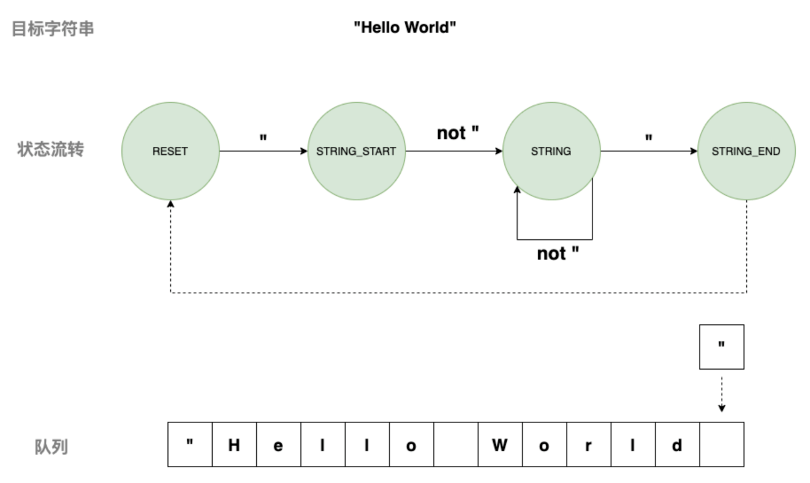
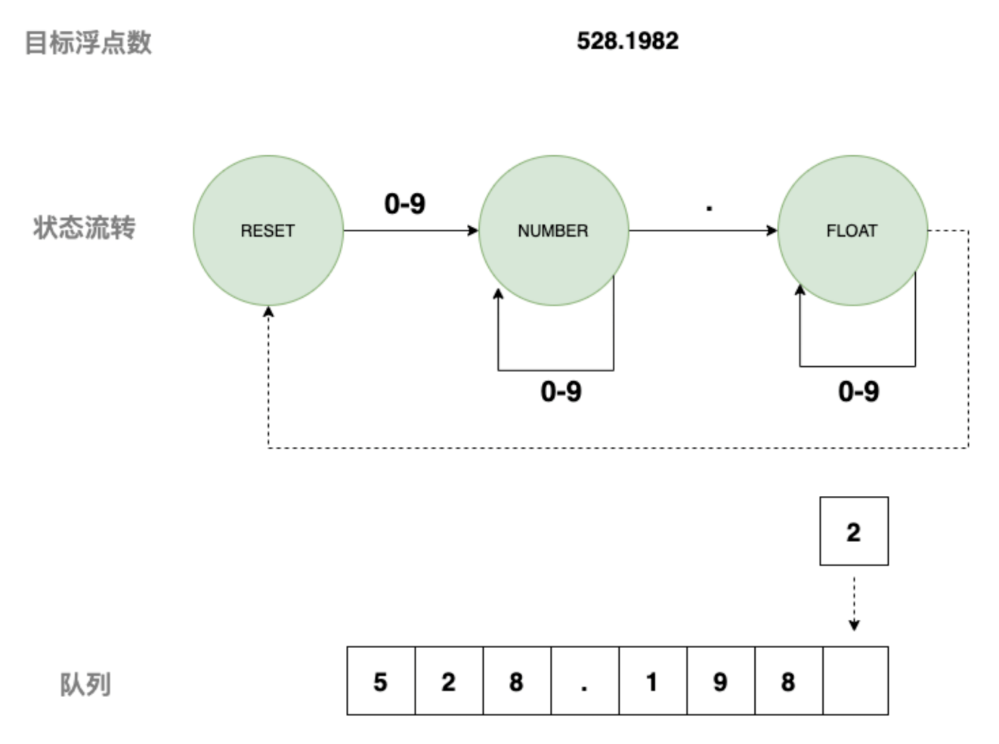
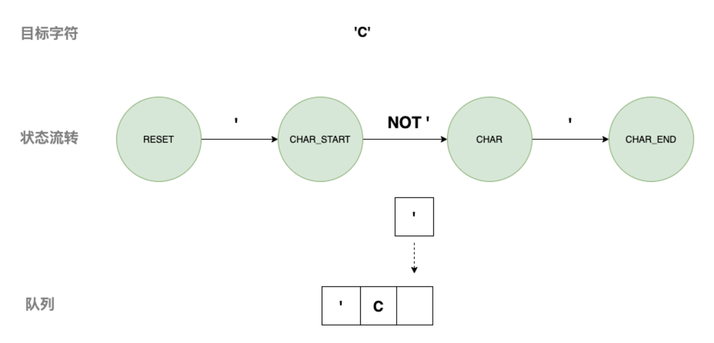
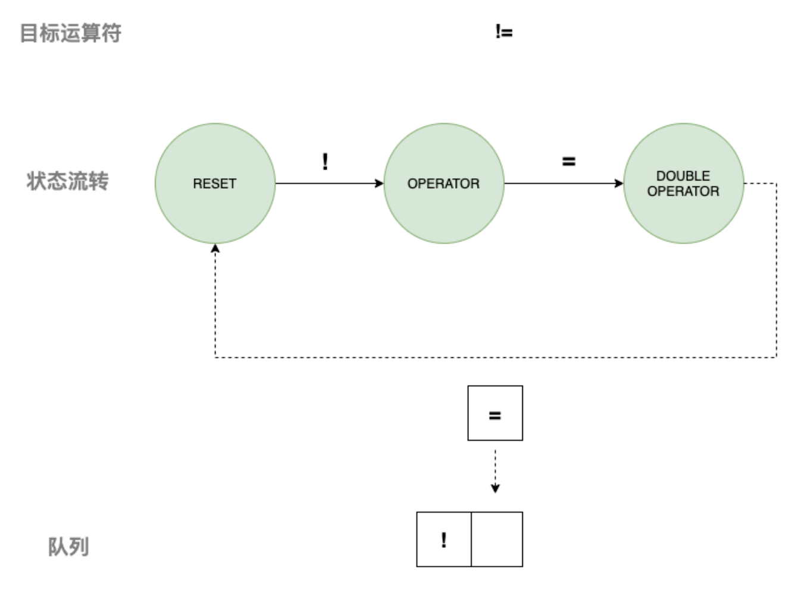

# 编译原理实验

本次实验的目的是通过编写一个简单的编译器，来加深对编译原理的理解。

## 实验一：词法分析器

### 问题描述

用C或C++语言编写一个简单的词法分析程序，扫描C语言小子集的源程序，根据给定的词法规则，识别单词，填写相应的表。如果产生词法错误，则显示错误信息、位置，并试图从错误中恢复。恢复方法为标记错误位置，跳过错误字符，继续扫描。


### 实验步骤

1. 确定翻译语言：C语言
2. 设计词法规则

    - 关键字：int、float、if、else、while、do、for、return
    - 标识符：以字母或下划线开头，后接字母、数字或下划线
    - 常数：整数、浮点数
    - 运算符：+、-、*、/、%、++、--、=、==、!=、<、<=、>、>=、&&、||、!
    - 分隔符：(、)、{、}、[、]、;、,、.
    - 注释：//、/* */
    - 指针：*、&
    - 字符串：以双引号括起来的字符序列
    - 用户自定义类型：struct、union、enum、typedef

3. 编写词法分析程序


### 实现思路

#### 直接扫描法

直接扫描法是一种最简单的词法分析方法，它是从源程序的第一个字符开始，逐个字符地进行扫描，根据字符的特点，将字符组成的字符串分解成一个个单词。
缺点：直接扫描法的效率较低，因为它是逐个字符地进行扫描，而且对于一些复杂的单词，需要进行多次的字符扫描。

#### 有限自动机法DFA

定义不同状态，如操作符、关键字、标识符、常数等，然后根据状态转移图，逐个字符地进行扫描，根据字符的特点，将字符组成的字符串分解成一个个单词。

再定义状态转移条件 ：如当前状态是初始状态，遇到数字则转移至数字状态，遇到符号则转移至符号状态

如果字符读取完成，则整个转移过程结束


##### 匹配字符串


##### 匹配浮点数


##### 匹配字符


##### 匹配运算符



#### 定义token类型

```c
/*********************************************************************************
 * token TYPE                  |introduction               | token的种别码
 * TYPE_KEYWORD                | 关键字                     | 1
 * TYPE_IDENTIFIER             | 标识符                     | 2
 * TYPE_NUMBER                 | 整数                       | 3
 * TYPE_FLOAT                  | 浮点数                     | 4
 * TYPE_NOTE                   | 注释                       | 5
 * TYPE_OPERATOR               | 运算符                     | 6
 * TYPE_SEPARATOR              | 分隔符                     | 7
 * TYPE_STRING                 | 字符串                     | 8
 * TYPE_CHAR                   | 字符                       | 9
 * TYPE_ERROR                  | 错误                       | 10
 * TYPE_EOF                    | 文件结束                   | 11
 *
 */

```

#### 定义DFA状态

```c
// 定义DFA的状态

/*********************************************************************************
 * DFA STATE                   |introduction               | token的种别码
 * STATE_START                 | 开始状态                   | 0
 * STATE_KEY_ID                | 关键字或标识符             | 1                     这里的关键字和标识符都是用一个状态来表示的
 * STATE_NUMBER                | 整数                       | 2
 * STATE_FLOAT                 | 浮点数                     | 3
 * STATE_NOTE_ONE              | 单行注释                   | 4
 * STATE_NOTE_MUL              | 多行注释                   | 5
 * STATE_OPERATOR              | 运算符                     | 6
 * STATE_STRING_START          | 字符串                     | 7
 * STATE_CHAR_START            | 字符                       | 8
 * STATE_ERROR                 | 错误                       | 9
 * STATE_END                   | 结束                       | 10
 */

```

判断标记符还是关键字
1.先全部跳转到标记符状态，然后再判断是否是关键字
2.如果是关键字，则将标记符状态转换为关键字状态


